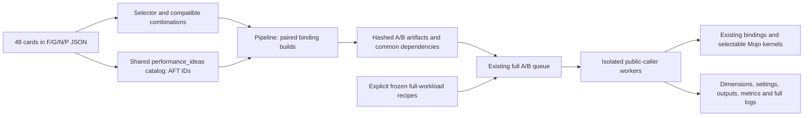

# Source integration handoff

The initial delivery connected individual switches to source kernels and added
a standalone metadata selector. It did **not** register the cards in the shared
A/B catalog or provide the paired-artifact/full-workload connection. This
follow-up programs those connections. Nothing described here was compiled,
checked, tested or measured; source integration is not runtime qualification.



## Connections programmed

- `tools/performance_ideas.py` now lists, plans and explicitly executes the
  namespaced `AFT_F01`–`AFT_P12` cards. Existing `F01` and `N01` experiments
  retain their meanings. Tree manifests are derived from the lane JSON rather
  than copied into 48 directories. Receipts bind to the lane JSON hash and
  frozen source commit. `source_ready` is the shared runner's source state;
  the additional qualification state still says uncompiled/unverified/unmeasured.
- `tools/apple_fast_tree_ideas.py pipeline-plan` connects each selection to the
  required binding closure and future commands. `workload-template` supplies
  a deliberately unfilled full-workload inventory. Neither command executes.
  Interaction output retains incompatible combinations as blocked cells.
- `pipeline.py build` uses existing binding builders and the M2 compile slot,
  applies the exact A/B defines to every affected binding, and records unchanged
  support libraries and the IDENTICAL input-transport helper separately.
  No pre-existing binary is silently accepted as a built candidate.
- `pipeline.py run` reuses those frozen binaries in independent packages and
  connects to `tools/performance_full_ab_queue.py`. The existing queue runs
  cells serially: one excluded warmup capture and one scored capture per arm.
  These captures use separate processes; that fact must remain in reports.
  Built-in adapters suppress duplicate internal warmups for this explicit mode.
- `capture_forest.py` reaches the actual forest/GBDT public driver. Its opt-in
  capture retains unrounded task metrics, real loaded binding paths/hashes,
  actual dimensions/settings, existing model/output receipts, and a new whole
  operation span including caller buffer preparation, construction, fit, sync,
  scoring and output consumption. Historical fit and inference times remain
  separate. No extra fit is introduced to generate a receipt.
- `capture_algos.py` connects the expanded tree harness for DART, TreeSHAP,
  decision trees, bagging, AdaBoost and random-trees embedding. Its explicit
  full-tree workload option keeps this preparation separate from existing
  capped board blocks; preparation and consumed outputs belong in the declared
  whole-operation span. Stock board recipes retain their original behavior.

All execution commands are for a later authorized campaign. No queue, selector,
manifest checker, builder, adapter or benchmark has been run in this session.

## Source integration repairs

| Issue found by reading source | Change |
| --- | --- |
| N08's grouped PairLogit unroll was attached to the wrong loop | Restored the original setup/function boundary and scoped the unroll to grouped evaluation. |
| N02 changed only the generic histogram launcher | Added the same opt-in replica policy to Apple's default quantized histogram launcher. |
| FAST forest public `parallel_groves` name can still use ordered resident arithmetic | P01/P03 now hold `MOJOLEARN_FOREST_ORDERED_RESIDENT_OFF` in both arms; P02 records the incompatible route. P04 argmax works after either traversal. |
| Ordered one-step fused estimation admitted multiple requested iterations | The fused route now requires one iteration; other requests use the existing batched walker. This is a correctness repair, not a performance promotion. |
| G03 recorded an incorrect disabling define | Corrected the conflict to `MOJOLEARN_GBDT_FUSED_PW_OFF`. |
| Broad card descriptions implied unreachable board coverage | Lane records now identify exact call chains, settings, bypasses and pending variants. |

## Full-workload contract

Future `run` requires `--recipes` or `MOJOLEARN_AFT_WORKLOADS`. The source-only
template contains no invented dimensions, hashes, metrics or quality evidence.
Fill it with the frozen source/selection and **actual full** cases. Each case
declares version/split and hashed dataset files, observed dimensions, estimator
settings, the actual prepared input-array digest, intrinsic-cap audit, timing boundary, candidate bindings, route
conditions, and a worker argument array. A worker must write
`aft-full-workload-v1` JSON with completion timings, metrics, consumed output or
model hashes, and actual loaded native-library hashes. The pipeline compares
the observed dataset, input-array digest, dimensions, settings and boundary to the frozen recipe.
Failed, missing, reduced or mismatched results remain failures, with logs kept.

The built-in adapters consume the same isolated package as custom full callers.
Use custom full callers for settings not exposed by saved board rows, including
N05's `min_split_gain=None`, explicit ranking pairs, some QueryRMSE settings,
weighted/regression/multiclass variants, non-board data and neighboring shapes.
The shared source kernels already connect to those public routes; the template
does not pretend every such workload is supplied by a default board command.
Any pending coverage remains visible and cannot qualify a default promotion.

`validate` captures evidence for review; it never turns a successful process
into a quality PASS. Later `time`/`run` additionally require an explicit quality
receipt (`--quality-receipt` or `MOJOLEARN_AFT_QUALITY_RECEIPT`) binding the source,
mode/vendor, all declared gates, and the exact workload-file SHA-256. Single-card
receipts also bind the lane JSON hash and `AFT_` ID; combination receipts bind
the complete selection. The shared runner forwards its admitted receipt. All
quality assessment, whole-coverage admission and board-tool updates remain
separate future work. No opponent ratio or default is inferred here.

Useful future metadata commands (not executed):

```sh
python3 tools/performance_ideas.py list --mode fast
python3 tools/performance_ideas.py plan AFT_F01 --stage build --vendor apple --output /outside/worktree/aft-f01
python3 tools/apple_fast_tree_ideas.py pipeline-plan F01,F02
python3 tools/apple_fast_tree_ideas.py workload-template P07
python3 tools/apple_fast_tree_ideas.py interaction X08
```

No new switch is enabled by default, no main merge is performed, and there are
still zero measured samples. The owner's prohibition on compile, verification,
tests and measurement also covers this integration follow-up.
